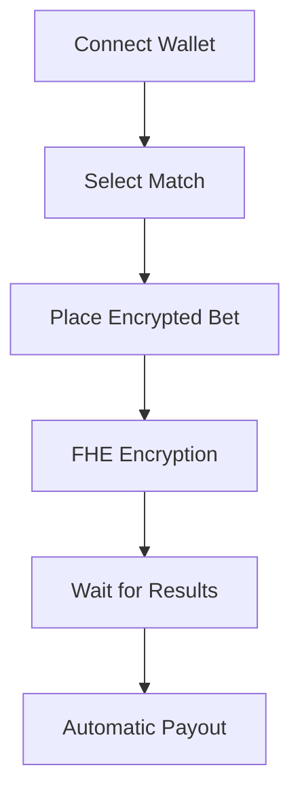

# ⚡ Neon Cipher Bet

> **The Future of Private eSports Wagering** 🎮

Transform your betting experience with cutting-edge FHE encryption technology. Place bets on your favorite eSports teams while keeping your strategies completely private until match resolution.

## 🚀 What Makes Us Different

- **🔒 Zero-Knowledge Betting**: Your bets remain encrypted until official results
- **⚡ Lightning-Fast**: Instant wallet connections with RainbowKit
- **🌐 Decentralized**: Built on Ethereum with full transparency
- **🎯 Smart Contracts**: Automated payouts with FHE-enabled privacy
- **🛡️ Bulletproof Security**: End-to-end encryption for maximum privacy

## 🛠️ Tech Arsenal

| Category | Technology |
|----------|------------|
| **Frontend** | React 18 + TypeScript + Vite |
| **Styling** | Tailwind CSS + shadcn/ui |
| **Blockchain** | Ethereum Sepolia Testnet |
| **Wallets** | RainbowKit + Wagmi + Viem |
| **Encryption** | FHE via Zama Protocol |
| **Smart Contracts** | Solidity with FHE Support |

## ⚡ Quick Start

### Prerequisites
- Node.js 18+ 
- npm or yarn
- Git

### Installation
```bash
# Clone the repository
git clone https://github.com/zkgirl88/neon-cipher-bet.git
cd neon-cipher-bet

# Install dependencies
npm install

# Start development server
npm run dev
```

### Environment Setup
Create `.env.local`:
```env
NEXT_PUBLIC_CHAIN_ID=11155111
NEXT_PUBLIC_RPC_URL=https://1rpc.io/sepolia
NEXT_PUBLIC_WALLET_CONNECT_PROJECT_ID=your_project_id
NEXT_PUBLIC_INFURA_API_KEY=your_infura_key
```

## 🎯 How It Works



1. **🔗 Connect**: Link your crypto wallet securely
2. **🎮 Bet**: Place encrypted bets on live matches  
3. **⏳ Wait**: Results revealed after official adjudication
4. **💰 Win**: Automatic payouts to your wallet

## 📁 Project Architecture

```
neon-cipher-bet/
├── 🎨 src/
│   ├── components/     # React components
│   ├── pages/         # Route pages
│   ├── lib/           # Utilities & configs
│   └── hooks/         # Custom hooks
├── 📜 contracts/
│   └── NeonCipherBet.sol  # FHE smart contract
└── 📚 docs/           # Documentation
```

## 🚀 Deployment

### Vercel (Recommended)
1. Fork this repository
2. Connect to Vercel
3. Set environment variables
4. Deploy! 🎉

### Manual Build
```bash
npm run build
npm run preview
```

## 🎮 Available Scripts

| Command | Description |
|---------|-------------|
| `npm run dev` | Start development server |
| `npm run build` | Build for production |
| `npm run preview` | Preview production build |
| `npm run lint` | Run ESLint checks |

## 🤝 Contributing

We welcome contributions! Here's how:

1. 🍴 Fork the repository
2. 🌿 Create a feature branch
3. ✨ Make your changes
4. 🧪 Test thoroughly
5. 📤 Submit a pull request

## 📄 License

This project is licensed under the MIT License - see the [LICENSE](LICENSE) file for details.

## 🆘 Support

- 🐛 **Bug Reports**: [Open an issue](https://github.com/zkgirl88/neon-cipher-bet/issues)
- 💡 **Feature Requests**: [Start a discussion](https://github.com/zkgirl88/neon-cipher-bet/discussions)
- 📧 **Contact**: [GitHub Issues](https://github.com/zkgirl88/neon-cipher-bet/issues)

---

<div align="center">

**⚡ Built with ❤️ for the future of private betting ⚡**

[](https://github.com/zkgirl88/neon-cipher-bet)
[](https://opensource.org/licenses/MIT)

</div>
